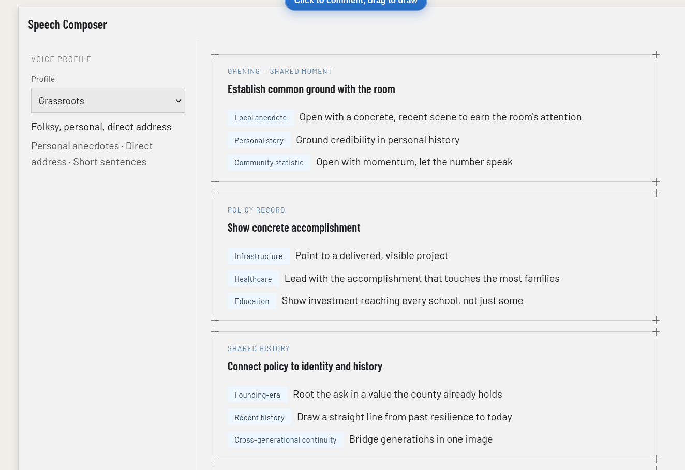

# Writing Style App

## The Problem

I chose to tackle writing speeches in the style of a principal.
This has a number of associated subproblems, namely:
1. It's necessary to understand the current context of the speech publically (place, time, news)
2. It's necessary to understand the currrent outlook, goals, and research performed by the principal's office.
3. It's necessary to match the principal's voice on a global composition level -- e.g. what do they like to talk about? do they communicate with anecdotes, facts and figures, rhetoric, appeals to history, etc?
4. It's necessary to match the principal's voice on a local composition level -- how do they choose words? How do they communicate concepts? What are their favorite tactical rhetorical constructions (anaphora, antithesis, etc.)

## Planning Notes

Originally, I broke down the process into three steps:
1. Deciding on the form of the speech -- this is a style choice, in terms of what does the principal like to talk about in terms of how speeches are composed at a metal level (Problem 3), in addition to the context that the speech is being written in -- folksy anecdotes are not great at state funerals but are excellent at the Iowa State Fair.
2. Deciding on the content that should be within the speech. This is what gets talked about in terms of accomplishments, policies, etc. This is tightly linked to 1. and 2. In my original thinking, I thought about structuring the speech in sections in step 1. and then associating those sections with specific sources from the public and private data
3. Doing a style pass on the entire speech that rewrites in the principal's voice based on the selected content and outline. This solves problem 4.

## Process Notes

### First Steps
I first tried to ground myself in data, aiming to scrape Abigail Spanberger's public speeches in order to give myself a corpus to work with. I quickly ran into problems with this (in particular, C-SPAN's API blocked scraping, so I mainly found stuff in press releases), and while I was able to resolve some of them I ended up with a lot of TV ads and other data that was intermixed. This wasn't necessarily a problem, since a lot of that is useful for `data/public`, but it made it much harder for me to really focus on speeches at the beginning since I was wrangling several different ingest pipelines. 

### Application
I knew that I wanted an application that could generate the content necessary for step 2. I wasn't yet sure of my data model, but as I had agents working on scraping + pulling in information, I kicked off an agent to set up a simple RAG app in parallel. I knew I would discard this pretty quickly but I wanted the bones there.

I chose Pydantic AI as my agent framework, backed by a QDrant vector DB, and a FastAPI and React frontend. I've previously vetted each of these technologies for other applications so I was confident that they could do what I wanted them to do.

For the core model, I used an anthropic API key from my anthropic account and embeddings from a google cloud project. I added a setup/setup.sh script that made creating a gcloud project and generating embeddings easier.

I used docker compose for portability to make it more easily run on other machines (my home computer runs linux, so I used podman to develop, but it should run on other people's machines too).

### UI

I then started thinking about the actual application experience. This was difficult -- I find that no one has really solved the collab experience with LLMs perfectly yet (claude design is a great example of this -- why can I not make many comments and send them at once? why doesn't the page autoreload instead of making me hit a button?) and also I wasn't entirely sure how to make my 1-3 steps truly interactive. I suppose I could have generated a pipeline that wasn't interactive to do it, but I was feeling a bit ambitious and I also didn't really believe a task like this was oneshottable, and wanted to create the right collaboration tool. The following is one of the UIs I ended up playing around with: 

Originally, this was more complex, but I also had some trouble getting claude to understand me. Being limited to Sonnet 5 to avoid blowing through my usage limits was difficult and I found myself missing Opus 😔

